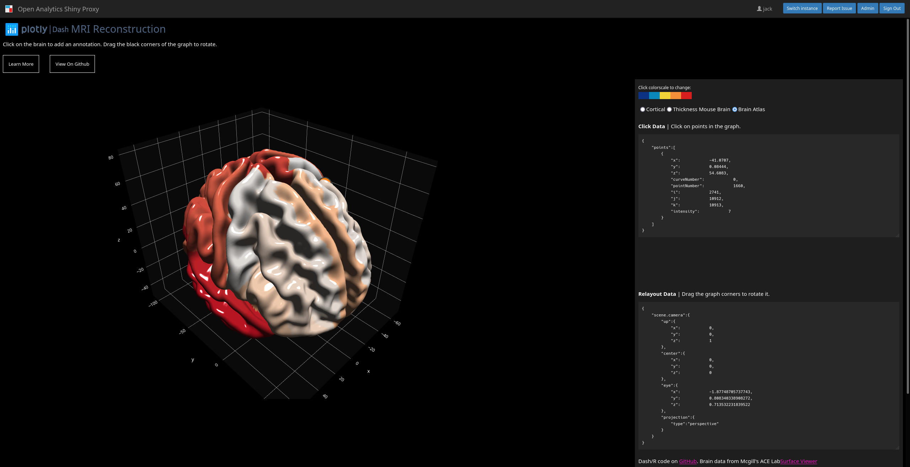

# Running Dash for R apps inside ShinyProxy

[Screenshots](#screenshots)

This repository explains how to run Dash for R apps in ShinyProxy. You will need to use at least ShinyProxy 2.5.0.

Dash requires the knowledge of the path used to access the app. By default the
dashr package reads the `DASH_REQUESTS_PATHNAME_PREFIX` environment variable to
determine this path, therefore you do not have to change your R code. You only
have to make sure that you do not overwrite this value and that the R server
listens on `0.0.0.0`. You can do this either by using the following R code:

```R
app$run_server(host = "0.0.0.0", port = 8050)
```

or using the following code and setting the `HOST` environment variable to
`0.0.0.0` (as is in done in our example):

```R
app$run_server()
```

## Building the Docker image

To pull the image made in this repository from Docker Hub, use

```bash
sudo docker pull openanalytics/shinyproxy-dash-for-r-demo
```

The relevant Docker Hub repository can be found at
[https://hub.docker.com/r/openanalytics/shinyproxy-dash-for-r-demo](https://hub.docker.com/r/openanalytics/shinyproxy-dash-for-r-demo).

To build the image from the Dockerfile, navigate into the root directory of this repository and run

```bash
sudo docker build -t openanalytics/shinyproxy-dash-for-r-demo .
```

## ShinyProxy Configuration

Create a ShinyProxy configuration file (see [application.yml](application.yml)
for a complete file), containing:

```yaml
- id: dashr-demo
  container-image: ledfan/shinyproxy-dash-r
  port: 8050
  container-env:
    # Use the following line when using ShinyProxy 2.6.0 or later
    DASH_REQUESTS_PATHNAME_PREFIX: "#{proxy.getRuntimeValue('SHINYPROXY_PUBLIC_PATH')}"
    # Use the following line when using ShinyProxy 2.5.0
    # DASH_REQUESTS_PATHNAME_PREFIX: "#{proxySpec.containerSpecs[0].env.get('SHINYPROXY_PUBLIC_PATH')}"
```

## Screenshots



**(c) Copyright Open Analytics NV, 2021.**
